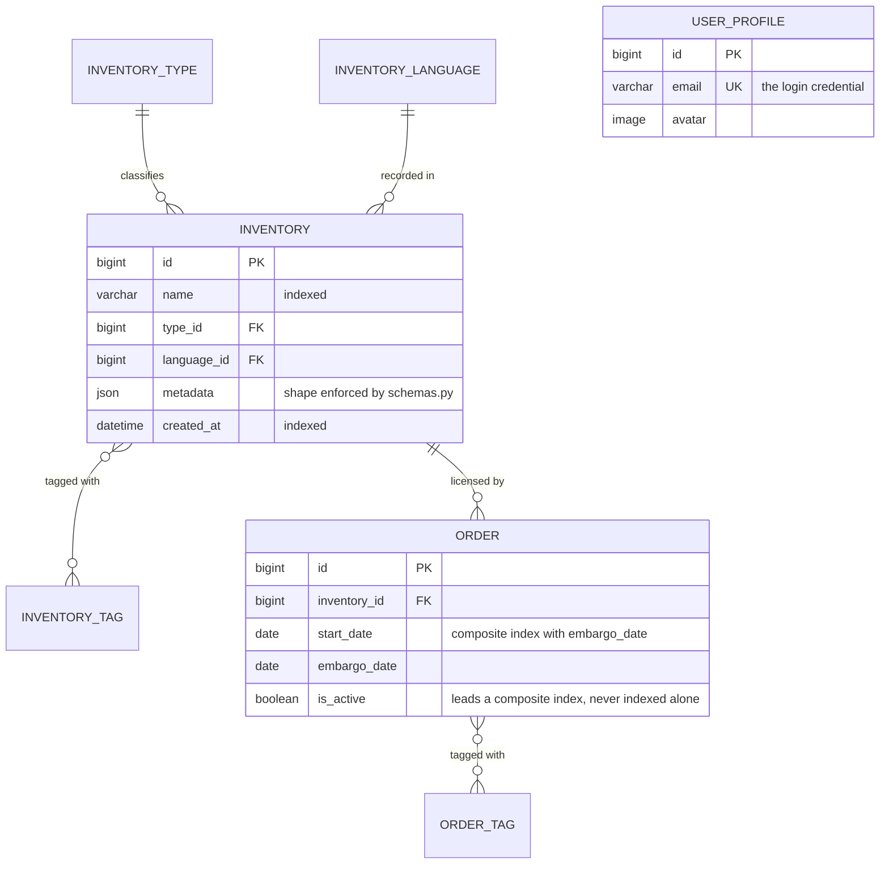

# TMT Inventory & Orders API

A Django REST Framework service for a media-licensing catalogue. **Inventory**
items — films, episodes and versions, each carrying a free-form metadata blob —
and the **orders** that license one of them for a window between a start date
and an embargo date. Languages, types and tags are reference data on both sides.

The repository began as a take-home skeleton: six models, a handful of views
and eight numbered exercises, preserved verbatim at
[`docs/challenge-brief.md`](docs/challenge-brief.md) so the code can be read
against what was asked. There is no front end — the two human-facing surfaces
are DRF's browsable API and Django's admin, the latter configured by the
`admin.py` in each app rather than built from scratch.

## The eight challenges, and where each one landed

| # | Asked for | Implemented in |
| --- | --- | --- |
| 1 | Inventory created after a given day | `InventoryCreatedAfterListView`, plus `?created_after=` on the main list |
| 2 | A `DeactivateOrderView` | `POST`/`PATCH /orders/<id>/deactivate/` |
| 3 | Orders between a start and an embargo date | `GET /orders/date-range/` |
| 4 | `UserProfile` as the auth model, plus admin | `interview/profiles/`, and each app's `admin.py` |
| 5 | Inventory pagination, 3 per page, offset/limit | `InventoryLimitOffsetPagination` |
| 6 | Tags on an order | `GET /orders/<id>/tags/` |
| 7 | Orders on a tag | `GET /orders/tags/<id>/orders/` |
| 8 | An explanation for a junior developer | [`challenge_8_explanation.md`](challenge_8_explanation.md) |

Nothing outside that list was added as a product feature. Three operational
extras exist because the repository needs them: `/healthz/` for the container
healthcheck, and the `seed_demo_data` and `benchmark_queries` commands.

## The data model



Every table also carries `created_at` and `updated_at`, and the type, language
and tag tables share one shape: id, unique `name`, plus `is_active` on the two
tag tables — columns supplied by abstract mixins in
`interview/core/behaviors.py`. `USER_PROFILE` stands apart on purpose: it
replaces `django.contrib.auth.User` as `AUTH_USER_MODEL` and authenticates on
email, but nothing in the domain records who placed an order.

## Endpoints

| Method | Path | Purpose |
| --- | --- | --- |
| `GET` `POST` | `/inventory/` | List (paginated, filterable) / create |
| `GET` | `/inventory/created-after/?created_after=` | Items created after a given day |
| `GET` `PATCH` `DELETE` | `/inventory/<id>/` | Retrieve / update / delete |
| `GET` `POST` | `/orders/` | List (paginated) / create, and `/orders/<id>/` to retrieve |
| `POST` `PATCH` | `/orders/<id>/deactivate/` | Set the activation state |
| `GET` | `/orders/date-range/?start_date=&embargo_date=` | Orders inside a window |
| `GET` | `/orders/<id>/tags/` | Tags on one order |
| `GET` | `/orders/tags/<id>/orders/` | Orders carrying one tag |
| `GET` | `/healthz/` | Liveness probe — also checks the database is reachable |

Reference data has list/create and retrieve/patch/delete routes under
`/inventory/tags/`, `/languages/`, `/types/` and `/orders/tags/`; the admin is
at `/admin/`. Every list endpoint is paginated with `limit` and `offset`:
inventory defaults to three per page, everything else to 25, capped at 100. Real
request/response pairs for all eight challenges are in
[`docs/api-transcript.txt`](docs/api-transcript.txt).


## Running it

With `POSTGRES_DB` unset the project uses SQLite, so nothing else need be
running:

```bash
./start.sh                             # venv, dependencies, migrate, seed
source .venv/bin/activate
python manage.py runserver             # http://127.0.0.1:8000/inventory/
pytest                                 # 135 tests, SQLite, no services needed
python manage.py seed_demo_data        # idempotent: 17 inventory items, 5 orders
black --check . && flake8 .            # line length 100
```

On Windows, run `start.bat` and activate with `.venv\Scripts\Activate.ps1`. For
PostgreSQL, `docker compose --file docker-compose.dev.yml up -d` and copy
`.env.example` to `.env` before `./start.sh`; for the whole stack, export a
`DJANGO_SECRET_KEY` and `docker compose up --build`, which serves on port 8960.
Use **Python 3.11** — `requirements.txt` pins `pydantic` 1.10.6 and `Pillow`
9.5.0, neither of which has wheels for 3.12+.

## Creating an inventory item

`POST /inventory/` is the path the brief's last challenge is about, and the one
place where validation, the schema registry and the transaction boundary meet.
The view validates with `InventoryWriteSerializer` and hands the result to
`services.create_inventory`, which — inside `transaction.atomic`, because tags
are attached after the insert — puts the metadata through the registry before
writing anything. `challenge_8_explanation.md` walks a junior through it.

Two details make the difference between it working and not. **Reads and writes
use different serializers**: a single class that nests
`InventoryTypeSerializer()` for output is, on input, demanding a nested object
that `ModelSerializer` cannot write, so `InventorySerializer` nests for the
client's convenience while `InventoryWriteSerializer` takes primary keys and
validates the foreign keys before the insert. And **metadata is round-tripped
through pydantic's JSON encoder**, not `.dict()` — `imdb_rating` is a `Decimal`,
which `json.dumps` cannot serialise.

`metadata` is a `JSONField`, so the database will accept any shape at all.
`interview/inventory/schemas.py` is the seam that stops it: one pydantic schema
per inventory type name, with a default for anything unregistered. Registering a
type-specific shape is two lines — `metadata_registry.register("Episode",
EpisodeMetadata)` against a subclass of `InventoryMetaData` — and touches
neither the service nor the view. Only the default is registered here; a
registry pre-filled with invented per-type shapes would be speculation. A
transposed key such as `rotten_toamtoes_rating` is rejected with a 400, and
`tests/inventory/test_schemas.py` pins that.

## Query counts

`OrderSerializer` nests `InventorySerializer`, which nests type, language and
tags, so serialising a page walks the ORM once per row per relation unless the
queryset says otherwise. `./manage.py benchmark_queries` measures both
configurations against the same data — captured runs in
[`docs/query-benchmark.txt`](docs/query-benchmark.txt):

| Endpoint | Without eager loading | With eager loading |
| --- | --- | --- |
| `GET /inventory/` | 301 queries, 43.1 ms | **2 queries, 8.5 ms** |
| `GET /orders/` | 501 queries, 70.0 ms | **3 queries, 23.5 ms** |

*500 rows, 100 per page, SQLite. Query counts are engine-independent, the
milliseconds are not.*

Eager loading is declared once per app in `selectors.py` rather than on each
view, and `test_inventory_list_query_count_is_independent_of_page_size` fails
loudly if someone drops it. Indexes exist where queries actually filter: a
composite `(start_date, embargo_date)` for the window endpoint,
`(is_active, -start_date)` for the active listing, `created_at` for "created
after". `is_active` gets no index of its own — a two-valued column has too
little selectivity to earn one. Pagination is a project-wide DRF default, and
`CONN_MAX_AGE` is 60 seconds. No cache, no queue, no read replica: every
request here is a short indexed query.

## How the code is arranged

Four apps under `interview/`, layered so dependencies point inward. Nothing in
the domain layer imports `rest_framework.Response` — services raise
`DomainError` subclasses from `interview/core/exceptions.py` and DRF translates
them — which is what lets the same rules run from a management command or a test
without going through HTTP.

```
config/settings/     base, local, production. Every value read from the environment.
interview/core/      Shared plumbing, no domain models: behaviours, pagination,
                     exceptions, the seed and benchmark commands, /healthz/.
interview/inventory/ The catalogue, and the metadata schema registry.
interview/order/     Licensing windows, activation, tag relations.
interview/profiles/  UserProfile, the project's AUTH_USER_MODEL.
tests/               135 tests mirroring the app layout.
```

Within an app, `views.py` deserialises, delegates and serialises,
`serializers.py` is wire format only, `services.py` holds write rules and
transactions, `selectors.py` holds queries and eager loading.

## Configuration

Everything is read from the environment. Copy [`.env.example`](.env.example) to
`.env` for local use — `.env` is git-ignored and must never be committed. It
carries the fourteen variables you are most likely to set; seven more
(`SQLITE_PATH`, `MEDIA_ROOT`, `APP_LOG_LEVEL`, `DJANGO_SECURE_SSL_REDIRECT`,
`DJANGO_CSRF_TRUSTED_ORIGINS`, `WEB_CONCURRENCY`, `WEB_TIMEOUT`) are read in
`config/settings/` and the `Dockerfile`. `DJANGO_SETTINGS_MODULE` defaults to
`config.settings.local` and should be `config.settings.production` for a
deployment, where `DJANGO_SECRET_KEY` and `DJANGO_ALLOWED_HOSTS` become
mandatory — `production.py` raises `ImproperlyConfigured` rather than falling
back. `POSTGRES_DB` switches the engine from SQLite to PostgreSQL. No settings
module contains a literal key or password, and `tests/test_settings.py` fails
the build if one reappears.

The brief says *"do not add any other packages to this project"*, so
`requirements.txt` is unchanged. Two files sit outside it, neither needed to run
the challenges: `requirements-dev.txt` adds **flake8**, enforcing the brief's
own requirement that the code be free of basic linting errors, and
`requirements-prod.txt` adds **gunicorn** for the container. No application
module imports either.

## Judgement calls worth arguing with

- **"Between" a start and an embargo date is containment, not overlap.** An
  order qualifies when it both starts no earlier and is embargoed no later than
  the requested window, so orders that merely overlap are excluded. The brief is
  genuinely ambiguous; the choice is stated in `interview/order/selectors.py`.
- **`is_authenticated` stays a property.** The brief asks for a method, but
  Django defines it as a property and its own middleware reads it as one, so
  making it callable would break `request.user.is_authenticated` project-wide.
  `tests/profiles/test_models.py` documents the disagreement. `is_admin` is
  likewise derived from `is_superuser` rather than stored.
- **"After a certain day" excludes the named day itself**, and deactivation is
  idempotent, so a retried `deactivate` cannot fail spuriously.

## What this does not do

- **No authentication, and no authorisation worth the name.** `production.py`
  requires an authenticated user, but nothing issues credentials — no
  registration, login or token endpoint, only session auth through `/api-auth/`
  and the admin. Permissions are all-or-nothing, with no per-object rules and no
  record of who owns an order, and under `local` the default is `AllowAny`.
- **`config/asgi.py` still points `DJANGO_SETTINGS_MODULE` at
  `interview.settings`**, a module that does not exist. Nothing imports the ASGI
  entrypoint — `runserver` and the container both go through WSGI — but an ASGI
  deployment would need that line corrected.
- **No API schema document** — OpenAPI would mean adding `drf-spectacular`,
  which the brief forbids — and **metadata is validated but not indexed**, so
  filtering on a field inside it is a full scan.
- **The Docker images have not been built or booted.** The `Dockerfile` is
  two-stage with a non-root user and a real `HEALTHCHECK`, and both compose
  files pass `docker compose config`, but no image has been produced. By the
  same token `config.settings.production` has never run against a deployment.
- **Django 4.1 stopped receiving security patches in December 2023**, but the
  pin is the brief's, not a choice.


Two further captures, both 1440x900 like the others and taken against a local
seeded server: the [inventory changelist](docs/screenshots/admin-inventory.png)
and the [orders-by-tag endpoint](docs/screenshots/browsable-orders-by-tag.png).
