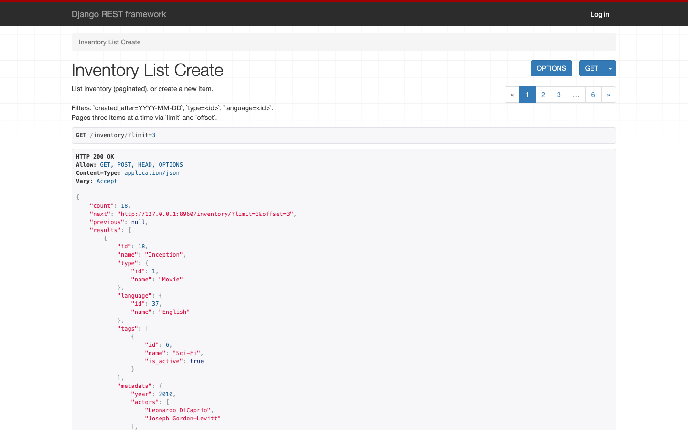
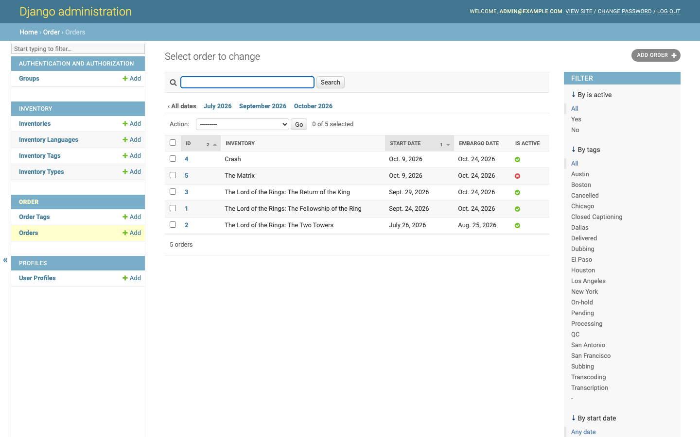
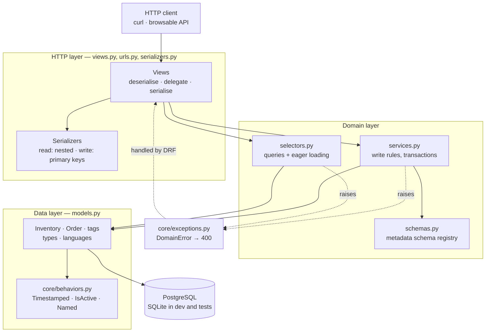
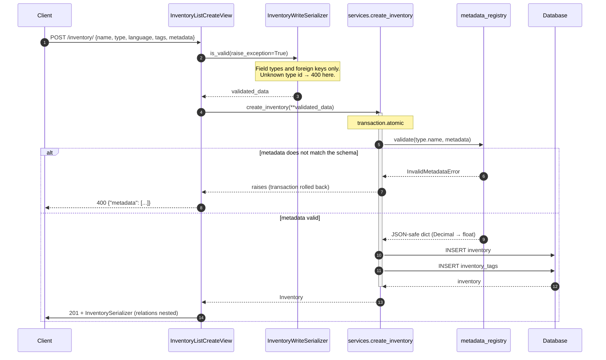

# TMT Inventory & Orders API

A Django REST Framework service for a media-licensing catalogue: **inventory**
items (films, episodes, versions, each with a free-form metadata blob) and the
**orders** that license them for a window between a start date and an embargo
date. Reference data — languages, types and tags — hangs off both.

It began as a take-home challenge skeleton: eight numbered exercises in the
README, an API that could not create a record, and no tests at all. The
original brief is preserved verbatim at
[`docs/challenge-brief.md`](docs/challenge-brief.md). This README documents
what the code now does.

---

## Captured output

No front end ships with this project, so the evidence below is real terminal
output and real request/response pairs, not mock-ups. Long `curl` lines are
wrapped for readability; the responses are verbatim. Full transcripts:
[`docs/api-transcript.txt`](docs/api-transcript.txt) and
[`docs/query-benchmark.txt`](docs/query-benchmark.txt).

Creating an inventory item — the flow that returned HTTP 400 for every
possible payload before the read/write serializer split:

```console
$ curl -s -w '\nHTTP %{http_code}\n' -X POST 'http://127.0.0.1:8960/inventory/' \
    -H 'Content-Type: application/json' \
    -d '{"name":"Inception","type":1,"language":37,"tags":[6],
         "metadata":{"year":2010,"actors":["Leonardo DiCaprio","Joseph Gordon-Levitt"],
                     "imdb_rating":8.8,"rotten_tomatoes_rating":87,
                     "film_locations":["Paris, France","Tokyo, Japan"]}}'
{"id":18,"name":"Inception","type":{"id":1,"name":"Movie"},"language":{"id":37,"name":"English"},"tags":[{"id":6,"name":"Sci-Fi","is_active":true}],"metadata":{"year":2010,"actors":["Leonardo DiCaprio","Joseph Gordon-Levitt"],"imdb_rating":8.8,"rotten_tomatoes_rating":87,"film_locations":["Paris, France","Tokyo, Japan"]},"created_at":"2026-09-24T21:38:55.404345Z"}
HTTP 201
```

Metadata is checked against a registered schema before it reaches the
database. Note the transposed characters in "tomatoes" — a typo that was
sitting in this repository's own seed fixture:

```console
$ curl -s -w '\nHTTP %{http_code}\n' -X POST 'http://127.0.0.1:8960/inventory/' \
    -H 'Content-Type: application/json' \
    -d '{"name":"Typo","type":1,"language":37,"metadata":{"year":2010,"actors":["X"],"imdb_rating":8.8,"rotten_toamtoes_rating":87}}'
{"metadata":[{"loc":["rotten_tomatoes_rating"],"msg":"field required","type":"value_error.missing"},{"loc":["rotten_toamtoes_rating"],"msg":"extra fields not permitted","type":"value_error.extra"}]}
HTTP 400
```

Setting an order's activation state:

```console
$ curl -s -X POST 'http://127.0.0.1:8960/orders/1/deactivate/' | python -m json.tool
{
  "id": 1,
  "is_active": false
}

$ curl -s -X POST 'http://127.0.0.1:8960/orders/1/deactivate/' \
    -H 'Content-Type: application/json' -d '{"is_active":true}' | python -m json.tool
{
  "id": 1,
  "is_active": true
}
```

(The transcript pipes these through a filter that selects `id` and
`is_active`; the full response is the whole order object.)

Eager loading, measured with `./manage.py benchmark_queries`:

```
rows=500 page_size=100 vendor=sqlite

endpoint              eager     queries        ms
-------------------------------------------------
GET /inventory/       yes             2       8.5
GET /inventory/       no            301      43.1
GET /orders/          yes             3      23.5
GET /orders/          no            501      70.0
```

The browsable API and the admin, both running locally against the seeded
database:





---

## Architecture

Four Django apps under `interview/`, layered so that dependencies point
inward: HTTP knows about services, services know about models, and nothing
points back out. A service never imports `rest_framework.Response`, which is
why the same rules run from a management command or a test.



- **`interview/core`** — no domain of its own. Abstract model behaviours,
  pagination classes, the domain exception hierarchy, the seed and benchmark
  commands, and the health endpoint.
- **`interview/inventory`** — the catalogue, and the metadata schema registry.
- **`interview/order`** — licensing windows, activation, tag relations.
- **`interview/profiles`** — the `UserProfile` model that replaces Django's
  default user.

## Request flow

The create path, which is where validation, the schema registry and the
transaction boundary all meet:



---

## Quickstart

Shortest path, no database server needed — with `POSTGRES_DB` unset the
project falls back to SQLite:

```bash
./start.sh                                  # venv, dependencies, migrate, seed
source .venv/bin/activate
python manage.py runserver                  # http://127.0.0.1:8000/inventory/
```

On Windows, run `start.bat` and activate with `.venv\Scripts\Activate.ps1`.

With PostgreSQL instead:

```bash
docker compose --file docker-compose.dev.yml up -d
cp .env.example .env                        # POSTGRES_* already point at it
./start.sh
```

Or the whole stack in containers:

```bash
export DJANGO_SECRET_KEY="$(python -c 'from django.core.management.utils import get_random_secret_key as k; print(k())')"
docker compose up --build                   # API on http://127.0.0.1:8960/
```

### Endpoints

| Method | Path | Purpose |
| --- | --- | --- |
| `GET` | `/healthz/` | Liveness probe; also checks the database |
| `GET` `POST` | `/inventory/` | List (paginated, filterable) / create |
| `GET` | `/inventory/created-after/?created_after=` | Items created after a given day |
| `GET` `PATCH` `DELETE` | `/inventory/<id>/` | Retrieve / update / delete |
| `GET` `POST` | `/inventory/tags/`, `/languages/`, `/types/` | Reference data |
| `GET` `PATCH` `DELETE` | `/inventory/tags/<id>/` etc. | Reference data detail |
| `GET` `POST` | `/orders/` | List (paginated) / create |
| `GET` | `/orders/<id>/` | Retrieve |
| `POST` `PATCH` | `/orders/<id>/deactivate/` | Set the activation state |
| `GET` | `/orders/date-range/?start_date=&embargo_date=` | Orders inside a window |
| `GET` | `/orders/<id>/tags/` | Tags on one order |
| `GET` | `/orders/tags/<id>/orders/` | Orders carrying one tag |
| `GET` `POST` | `/orders/tags/` | Order tags |
| `GET` | `/admin/` | Django admin |

Every list endpoint is paginated with `limit` and `offset`. Inventory defaults
to 3 per page; everything else to 25, capped at 100.

---

## Configuration

Every value is read from the environment. Copy `.env.example` to `.env` for
local use — `.env` is git-ignored and must never be committed.

| Variable | Required | Default | Purpose |
| --- | --- | --- | --- |
| `DJANGO_SECRET_KEY` | Yes in production | dev placeholder in `local` | Signing key. `production` refuses to start without it. |
| `DJANGO_DEBUG` | No | `1` in `local`, forced `0` in `production` | Debug mode. |
| `DJANGO_ALLOWED_HOSTS` | Yes in production | `localhost,127.0.0.1,[::1],testserver` in `local` | Comma-separated host allowlist. |
| `DJANGO_SETTINGS_MODULE` | No | `config.settings.local` | `config.settings.production` for deployments. |
| `DJANGO_LOG_LEVEL` | No | `INFO` | Root log level. |
| `APP_LOG_LEVEL` | No | `INFO` | Level for the `interview` logger. |
| `POSTGRES_DB` | No | *(unset — SQLite is used)* | Setting it switches the engine to PostgreSQL. |
| `POSTGRES_USER` | No | `postgres` | Database user. |
| `POSTGRES_PASSWORD` | No | *(empty)* | Database password. |
| `POSTGRES_HOST` | No | `127.0.0.1` | Database host. |
| `POSTGRES_PORT` | No | `5432` | Database port (`5444` via the compose file). |
| `DB_CONN_MAX_AGE` | No | `60` | Seconds to keep a connection open. |
| `SQLITE_PATH` | No | `<repo>/db.sqlite3` | SQLite file when Postgres is not configured. |
| `MEDIA_ROOT` | No | `media` | Directory for uploaded avatars, relative to the repo root. |
| `INVENTORY_PAGE_SIZE` | No | `3` | Default page size for inventory listings. |
| `API_PAGE_SIZE` | No | `25` | Default page size everywhere else. |
| `DJANGO_SECURE_SSL_REDIRECT` | No | `1` in `production` | Set to `0` when a proxy already terminates TLS. |
| `DJANGO_CSRF_TRUSTED_ORIGINS` | No | *(empty)* | Comma-separated origins for cross-origin form posts. |
| `WEB_CONCURRENCY` | No | `2` | Gunicorn workers (container only). |
| `WEB_TIMEOUT` | No | `30` | Gunicorn worker timeout (container only). |

---

## Development

```bash
source .venv/bin/activate

python manage.py migrate
python manage.py seed_demo_data        # idempotent; --flush to start clean
python manage.py runserver

pytest                                 # the full suite
pytest tests/inventory -v              # one app
pytest --no-header -q                  # quiet

black .                                # format (line length 100)
black --check .                        # verify without writing
flake8 .                               # lint

python manage.py benchmark_queries --rows 500 --page-size 100
```

Tests run against SQLite with no external service, so `pytest` works on a
fresh clone with nothing else running.

### A note on dependencies

The challenge brief says *"do not add any other packages to this project to
complete the work"*, and `requirements.txt` is therefore unchanged. Two
additions sit outside it:

- `requirements-dev.txt` adds **flake8**, purely to enforce the brief's own
  requirement that the code be "free of basic linting errors".
- `requirements-prod.txt` adds **gunicorn**, because the container needs a
  WSGI server. No application code imports either.

Neither is needed to run the challenges. `black`, `pytest` and `pytest-django`
were already pinned in `requirements.txt` but unused; so was `python-dotenv`,
which now actually loads `.env`.

---

## Project structure

```
config/
  settings/
    base.py             Shared settings. Reads everything from the environment.
    local.py            Development: DEBUG on, permissive hosts, dev key.
    production.py       Fails fast without a real key; locks the API down.
  urls.py               Root URL configuration.

interview/
  core/                 Shared plumbing; owns no domain models.
    behaviors.py        Abstract mixins: UUID, Timestamped, IsActive, Name.
    exceptions.py       DomainError hierarchy; maps onto 4xx responses.
    pagination.py       Offset/limit pagination defaults.
    seed_data.py        Demo fixture as pure data — no database access.
    urls.py, views.py   The /healthz/ liveness probe.
    management/commands/
      seed_demo_data.py Idempotent fixture loader.
      benchmark_queries.py  Measures the N+1 cost; backs the numbers above.

  inventory/            The catalogue.
    models.py           Inventory, InventoryType/Language/Tag.
    schemas.py          Metadata schema registry — the main extension point.
    selectors.py        Queries and eager loading; date-filter semantics.
    services.py         Create/update/delete rules, transaction boundaries.
    serializers.py      Split read (nested) and write (primary key) classes.
    views.py, urls.py   Thin HTTP layer.

  order/                Licensing windows and activation. Same file roles.
  profiles/             UserProfile: the project's AUTH_USER_MODEL.

tests/                  135 tests, mirroring the app layout.
  conftest.py           Fixtures; no factory library, per the brief.
  test_settings.py      Guards against a secret being hardcoded again.
  test_urls.py          Every route resolves to the view it claims.

docs/
  challenge-brief.md    The original brief, verbatim.
  api-transcript.txt    Captured request/response pairs.
  query-benchmark.txt   Captured benchmark output.
  screenshots/          Browsable API and admin, 1440x900.
```

---

## Design notes

### Layering: services and selectors, not fat views

The original views held the business rules directly — one of them mutated
`request.data` in place to validate a field. Rules that live in a view cannot
be reused by a management command, an admin action or a background job, so the
next person to write inventory data quietly skips them.

Each app is now split into `services.py` (writes, transactions, invariants)
and `selectors.py` (queries, eager loading, filter parsing). Views deserialise,
delegate, and serialise. Services raise `DomainError` subclasses rather than
returning responses, so the domain layer has no dependency on HTTP at all.

### Read and write want different representations

`InventorySerializer` declared `type = InventoryTypeSerializer()`, which reads
beautifully and writes not at all: on input DRF demanded a nested object that
`ModelSerializer` cannot write anyway. Every `POST /inventory/` returned 400.
Splitting into a read class (relations nested) and a write class
(`PrimaryKeyRelatedField`) fixes it and, as a bonus, validates foreign keys
before the insert. Full walk-through in
[`challenge_8_explanation.md`](challenge_8_explanation.md).

### The real bottleneck was N+1, not throughput

Both serializers nest relations, and `OrderSerializer` nests
`InventorySerializer`, which itself nests type, language and tags. Serialising
a page therefore walked the ORM once per row per relation. Measured with
`./manage.py benchmark_queries` on 500 rows at 100 per page:

| Endpoint | Before | After |
| --- | --- | --- |
| `GET /inventory/` | 301 queries, 43.1 ms | **2 queries, 8.5 ms** |
| `GET /orders/` | 501 queries, 70.0 ms | **3 queries, 23.5 ms** |

The fix is `select_related`/`prefetch_related` defined once per app in
`selectors.py`, so every caller inherits it rather than each view remembering.
`tests/inventory/test_query_counts.py` asserts the count is independent of
page size, which fails loudly if someone drops the eager loading later.

Three supporting decisions:

- **Pagination is a project-wide default, not a per-view opt-in.** An
  unbounded list endpoint is fine against 17 seed rows and a liability against
  real data. `limit` is capped at 100.
- **Indexes were added where queries actually filter**: a composite
  `(start_date, embargo_date)` for the window endpoint, `(is_active,
  -start_date)` for the common active listing, and `created_at` for the
  "created after" filter. `is_active` gets no index of its own — a two-valued
  column has too little selectivity to help, so it appears only as the leading
  column of a composite.
- **`CONN_MAX_AGE` defaults to 60s**, so connections are reused instead of
  being opened per request.

What was deliberately *not* done: no cache layer, no queue, no read replica.
Every request here is a short indexed query against a small dataset, and
adding that machinery would be answering a question nobody asked.

### Extensibility: one seam, at the untyped column

`Inventory.metadata` is a `JSONField`, so the database accepts any shape. That
is genuinely convenient and genuinely dangerous — this repository already
shipped a row keyed `rotten_toamtoes_rating`.

`schemas.py` holds a `MetadataSchemaRegistry` that maps an inventory type name
to the pydantic schema its metadata must satisfy. Anything unregistered falls
back to the default. Supporting a type-specific shape is two lines and touches
neither the service nor the view:

```python
class EpisodeMetadata(InventoryMetaData):
    season: int
    episode: int

metadata_registry.register("Episode", EpisodeMetadata)
```

This is the one seam a future developer here would actually reach for. A
provider interface or a plugin loader would be speculation.

### Settings, and the secret that was committed

The repository's history shows `SECRET_KEY = os.environ.get("SECRET_KEY")`
being *replaced* by a hardcoded literal, alongside a hardcoded database
password. Both are now read from the environment; `production.py` raises
`ImproperlyConfigured` rather than falling back to a known value, and
`tests/test_settings.py` fails if a literal ever reappears.

`BASE_DIR` also resolved to `config/` rather than the repository root — one
`.parent` short — which would have put `STATIC_ROOT` and `MEDIA_ROOT` inside
the settings package.

### Permissions

The API is open under `local` settings so the browsable API works on a fresh
clone. `production.py` overrides `DEFAULT_PERMISSION_CLASSES` to
`IsAuthenticated` and drops the browsable renderer. `/healthz/` stays open in
both, because an orchestrator cannot authenticate. See the limitations below —
this is a coarse control, not an authorisation model.

### The user model

`UserProfile` replaces Django's default user and authenticates on email.
The brief asked for `is_authenticated()` as a method; Django defines it as a
property and its own middleware reads it as one, so **it is kept as a
property** — making it callable would break `request.user.is_authenticated`
everywhere. Similarly `is_admin` is derived from `is_superuser` rather than
stored, so the two cannot drift apart. Both choices are covered by tests in
`tests/profiles/test_models.py`.

### Seed data

`database.py` was a top-level script that ran on import, inserted
unconditionally, and therefore failed on a unique constraint the second time
anyone ran it. It is now `core/seed_data.py` (pure data, no side effects) plus
an idempotent `seed_demo_data` command. Relations are expressed by name rather
than by primary key, since `language_id=37` silently assumes one insertion
order.

---

## Limitations

- **No authentication endpoints.** `production.py` requires an authenticated
  user, but nothing issues credentials: there is no registration, login or
  token endpoint. Session auth through `/api-auth/` and the admin is all that
  exists. Adding JWT or OAuth was outside the brief.
- **Permissions are all-or-nothing.** There is no per-object authorisation and
  no notion of who owns an order. Any authenticated user can mutate any record.
- **`DEFAULT_PERMISSION_CLASSES` is `AllowAny` under `local` settings**, which
  is what the tests and the browsable API run against. That is deliberate for
  a development profile, but it does mean the test suite does not exercise the
  production permission configuration beyond asserting how it is set.
- **The date-window endpoint uses containment, not overlap.** An order
  qualifies when it both starts no earlier and is embargoed no later than the
  requested window. Orders that merely *overlap* the window are excluded. The
  brief said "between", which is ambiguous; the choice is documented in
  `interview/order/selectors.py` and would be a one-line change.
- **No API schema document.** OpenAPI would mean adding `drf-spectacular`,
  which the brief forbids. The browsable API is the only interactive
  documentation.
- **Metadata is validated but not indexed.** Filtering or sorting on a field
  inside `metadata` would be a full scan. A generated column plus an index, or
  promoting hot fields to real columns, is the fix if that need arrives.
- **Benchmarks were measured on SQLite**, because Docker was unavailable when
  they were captured. The query *counts* are engine-independent; the
  millisecond figures would differ on PostgreSQL over a network.
- **Docker images are unbuilt.** The `Dockerfile` and both compose files parse
  (`docker compose config` passes) but have not been built or booted — the
  daemon was not running in the environment where this work was done.
- **`config.settings.production` has never run against a real deployment.**
  Its security settings are conventional but untested outside the assertions
  in `tests/test_settings.py`.
